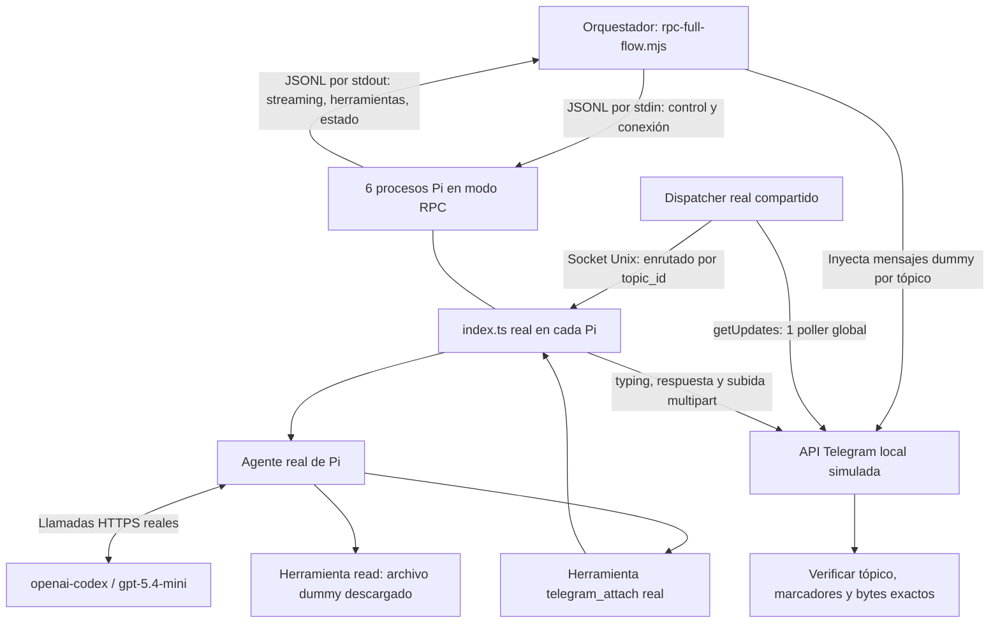

# Prueba de flujo Telegram con seis Pi reales por RPC

## Resumen del Test y Estado Actual

Harness de prueba end-to-end multitópico para el puente Telegram (`pi-telegram`). Ejecuta **procesos Pi reales** en modo RPC con el **modelo real `gpt-5.4-mini`** (o `gpt-5.6-luna` como alternativa) y la extensión de producción sin alterar. El único componente simulado es la API de Telegram mediante un servidor HTTP local en localhost.

| Métrica / Parámetro | Configuración |
|---|---|
| Ejecución | `systemd-run` o terminal directa (`node audit/rpc-full-flow.mjs`) |
| Modelo real | `openai-codex/gpt-5.4-mini` (fallback: `gpt-5.6-luna`), thinking low |
| Procesos Pi reales | **Hasta 6 simultáneos** (configurable de 1 a 6) |
| Entradas de usuario | **2 olas por sesión** (Ola A: texto concurrente; Ola B: adjunto bidireccional) |
| Transferencias de archivos | Verificación byte a byte de descarga y subida multipart por tópico |
| Guardias de seguridad | [`rpc-audit-guard.ts`](rpc-audit-guard.ts) con creación segura de rutas y límites de herramientas |
| Redirección de red | [`rpc-telegram-transport.mjs`](rpc-telegram-transport.mjs) (intercepta Telegram sin alterar tráfico del LLM) |

Reporte de referencia histórica: [`results/rpc-six-2026-09-24.json`](results/rpc-six-2026-09-24.json).

---

## Arquitectura del Circuito



**Por qué no enviar los mensajes dummy directamente por RPC:**  
Una llamada RPC `prompt` saltaría el polling del dispatcher, el enrutado por socket Unix y el ciclo de vida del puente. Con este diseño, RPC se usa como arnés de control y monitoreo (`get_state`, `get_session_stats`), mientras las entradas y salidas de usuario viajan a través del flujo real de Telegram.

---

## Secuencia de Ejecución

1. **Entorno y Credenciales:**
   - Detecta si el proceso corre en un cgroup de systemd o en terminal estándar. (Si `AUDIT_REQUIRE_CGROUP=1` está definido, exige límites de memoria <= 3 GiB y swap 0).
   - Lee la credencial `openai-codex` desde `~/.pi/agent/auth.json` y valida que tenga más de 6 minutos de vigencia si es OAuth.
2. **Aislamiento Temporal:**
   - Crea un `HOME` temporal aislado con configuración ficticia de Telegram (`botToken: '1:audit'`, supergroup forum `-100`).
   - Prepara directorios de trabajo y sesiones independientes para cada una de las $N$ instancias.
3. **Servicios de Red:**
   - Inicia el servidor emulador HTTP local de Telegram en un puerto efímero.
   - Lanza el proceso [`dispatcher.mjs`](../dispatcher.mjs) real, que conecta con el emulador y expone `dispatcher.sock`.
4. **Instancias Pi RPC:**
   - Lanza $N$ procesos de Pi (`pi --mode rpc`) con el modelo `gpt-5.4-mini` (o variable `PI_AUDIT_MODEL`), cargando [`index.ts`](../index.ts) y la guardia [`rpc-audit-guard.ts`](rpc-audit-guard.ts).
   - Desactiva reintentos y compactación automática por RPC para evitar trabajo silencioso no contabilizado.
   - Envía `/telegram-connect` a cada Pi para crear/vincular su tópico en el foro.
5. **Ola A (Texto Simultáneo):**
   - Encola simultáneamente $N$ mensajes en el emulador, uno por tópico.
   - El dispatcher procesa el lote de `getUpdates` y reparte cada mensaje a su socket Unix correspondiente.
   - Se verifica que cada Pi responda con su marcador único `RPC_TEST_${index}_A` al tópico asignado y que se emitan eventos de typing (`sendChatAction`).
6. **Ola B (Ida y Vuelta de Adjuntos):**
   - Publica en cada tópico un archivo de prueba exclusivo (`dummy-${index}.txt`) con token único.
   - Cada Pi descarga el archivo a `~/.pi/agent/tmp/telegram/`, lo lee con `read`, lo adjunta con `telegram_attach` y emite su respuesta final.
   - El emulador intercepta el `sendDocument` multipart y **compara los bytes subidos contra el documento original del tópico**, certificando que no hubo cruce de archivos entre sesiones.
7. **Auditoría y Cierre:**
   - Consulta `get_session_stats` y el estado final de streaming de cada Pi.
   - Envía `/telegram-disconnect` a cada sesión, cierra procesos ordenadamente y guarda `report.json`.

---

## Controles de Seguridad y Robustez

- **Guardia de Extensiones ([`rpc-audit-guard.ts`](rpc-audit-guard.ts)):**
  - Asegura la creación idempotente del directorio `tmp/telegram` antes de llamar a `realpath`.
  - Limita el acceso exclusivamente al archivo asignado de ese tópico, con tope de 1 MiB.
  - Bloquea herramientas fuera de `read` y `telegram_attach`.
  - Aborta automáticamente si un agente excede 8 turnos o 6 llamadas a herramientas.
- **Tolerancia en el Runner ([`rpc-full-flow.mjs`](rpc-full-flow.mjs)):**
  - El parser de stdout procesa líneas JSON de eventos RPC e ignora líneas no estructuradas (como advertencias de Node.js o runtime), previniendo abortos accidentales.
  - Detección flexible de cgroup: admite corridas directas o encapsuladas con métricas detalladas (`VmRSS`, `memory.current`, `cpu.stat`).

---

## Cómo Ejecutar

> **Nota:** Las pruebas invocan el modelo real configurado (`gpt-5.4-mini`) y consumen tokens de tu cuenta.

### 1. Ejecución Directa en Terminal (Rápida)

Para probar con **1 sesión** (smoke test):
```bash
node audit/rpc-full-flow.mjs 1
```

Para probar con **6 sesiones simultáneas**:
```bash
node audit/rpc-full-flow.mjs 6
```

Para forzar un modelo específico mediante variable de entorno:
```bash
PI_AUDIT_MODEL=gpt-5.4-mini node audit/rpc-full-flow.mjs 6
# o con fallback:
PI_AUDIT_MODEL=gpt-5.6-luna node audit/rpc-full-flow.mjs 6
```

### 2. Ejecución con Contención en systemd (Recomendado para estrés)

Permite limitar memoria estricta y monitorear el cgroup sin privilegios de root:

```bash
systemd-run --user \
  --unit=pi-rpc-audit-six \
  --property=MemoryMax=3G \
  --property=MemorySwapMax=0 \
  --property=CPUQuota=150% \
  --property=TasksMax=192 \
  --property=RuntimeMaxSec=300s \
  --property=WorkingDirectory="$PWD" \
  /usr/bin/node "$PWD/audit/rpc-full-flow.mjs" 6
```

#### Monitoreo durante la ejecución:

```bash
journalctl --user -fu pi-rpc-audit-six.service
```

```bash
watch -n 1 'systemctl --user show pi-rpc-audit-six.service \
  -p ActiveState -p Result -p MemoryCurrent -p MemoryPeak -p TasksCurrent -p CPUUsageNSec'
```

#### Detener anticipadamente:

```bash
systemctl --user stop pi-rpc-audit-six.service
```

---

## Prueba Unitaria del Transporte (Offline, 0 Costo)

Para comprobar el mecanismo de intercepción de red sin iniciar Pi ni gastar tokens:

```bash
node --test audit/rpc-telegram-transport.test.mjs
```

---

## Archivos del Test

- [`rpc-full-flow.mjs`](rpc-full-flow.mjs): Orquestador, emulador HTTP local, cliente RPC y aserciones.
- [`rpc-audit-guard.ts`](rpc-audit-guard.ts): Guardia de seguridad inyectada en cada instancia de Pi.
- [`rpc-telegram-transport.mjs`](rpc-telegram-transport.mjs): Preload que redirige peticiones de Telegram al mock local.
- [`rpc-telegram-transport.test.mjs`](rpc-telegram-transport.test.mjs): Test unitario offline del transporte.
- [`results/`](results/): Reportes de corridas previas.
