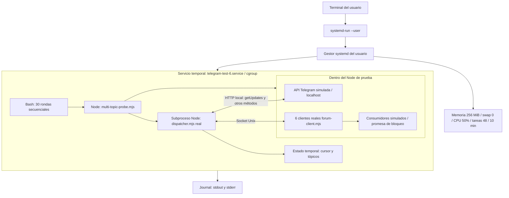
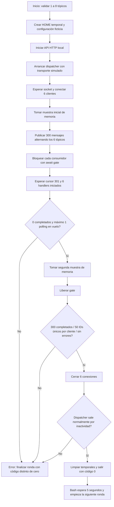

# Prueba de seis tópicos Telegram con systemd

## Resumen

Esta prueba ejecuta **el dispatcher y seis clientes reales del puente**, pero sustituye Telegram por un pequeño servidor HTTP local y sustituye los agentes Pi por consumidores simulados.

**systemd no realiza las comprobaciones del test.** Ejecuta el programa, limita los recursos de todo su grupo de procesos y recoge su salida. Las comprobaciones las hace el script Node mediante `assert` y esperas con timeout.

Resultado reportado por el usuario: **ronda 30 completada y `Result=success`**.

> Esto valida el escenario acotado del test. No demuestra que seis agentes completos trabajando durante horas sean seguros ni determina la causa de los congelamientos del equipo.

## 1. Infografía: qué se ejecutó

```text
                          UNA EJECUCIÓN COMPLETA
                  ┌────────────────────────────────┐
                  │ 1 servicio temporal de systemd │
                  │ 30 rondas, una detrás de otra  │
                  └───────────────┬────────────────┘
                                  │
                            EN CADA RONDA
                  ┌───────────────▼────────────────┐
                  │ 6 clientes / tópicos           │
                  │ 50 mensajes por tópico         │
                  │ 300 mensajes en total          │
                  │ ~4 KB de texto por mensaje     │
                  └───────────────┬────────────────┘
                                  │
                 CONSUMIDORES BLOQUEADOS A PROPÓSITO
                  ┌───────────────▼────────────────┐
                  │   6 handlers esperando         │
                  │ 294 handlers en cola           │
                  │   0 mensajes completados       │
                  └───────────────┬────────────────┘
                                  │ liberar consumidores
                  ┌───────────────▼────────────────┐
                  │ 300 completados                │
                  │ 50 por tópico, sin duplicados  │
                  │ cierre y limpieza              │
                  └────────────────────────────────┘

   30 × 300 = 9.000 mensajes sintéticos a lo largo de toda la prueba.
   No hay 9.000 mensajes simultáneos ni 180 clientes simultáneos.
```

Entre rondas se esperan cinco segundos. Cada ronda crea conexiones y procesos nuevos: **no son seis conexiones permanentes durante las 30 rondas**.

## 2. Componentes reales y simulados

| Componente | Tipo | Función |
|---|---|---|
| `dispatcher.mjs` | Código de producción real | Consulta actualizaciones, enruta por tópico y persiste el cursor |
| `forum-client.mjs` | Código de producción real, seis instancias | Conecta por socket Unix y serializa callbacks de entrada |
| `forum.mjs` | Código de producción real | Configuración, mapas de tópicos y persistencia JSON |
| Socket Unix | Real, en directorio temporal | Comunicación dispatcher–clientes |
| Archivos de estado | Reales, temporales | Configuración ficticia, cursor y mapa de tópicos |
| Servidor Telegram | Simulado en `127.0.0.1` | Responde a los métodos necesarios y entrega mensajes sintéticos |
| Token / usuario / grupo | Ficticios | Permiten probar rutas sin credenciales reales |
| Agentes Pi / LLM | **No se ejecutan** | Se sustituyen por callbacks bloqueables |
| `index.ts` | **No se carga en esta sonda** | Sus previews, typing, colas de turnos y transferencias no se ejercitan aquí |
| Red externa de Telegram | **No se utiliza en el recorrido normal del test** | El transporte del dispatcher se redirige al servidor local |

Los seis clientes viven dentro de un mismo proceso Node de prueba. El dispatcher vive en otro proceso Node. No se abren seis procesos Pi.

## 3. Arquitectura y límite de recursos

Diagrama Mermaid; puede renderizarse en un visor Markdown compatible. En un visor sin Mermaid se mostrará como código.



La caja del servicio es **un grupo de contabilidad y límites, no una máquina virtual ni un contenedor de seguridad**. No aísla por sí sola el sistema de archivos o la red. La sonda usa un HOME temporal y datos ficticios por diseño.

### Qué significa cada límite

| Opción | Efecto |
|---|---|
| `--user` | Usa el gestor systemd de tu usuario; no necesita sudo para iniciar el test |
| `--unit=telegram-test-6` | Da un nombre al servicio para consultar sus logs, estado o detenerlo |
| `WorkingDirectory="$PWD"` | Ejecuta desde la raíz del repositorio |
| `MemoryMax=256M` | Límite de memoria contabilizada al conjunto del servicio: Bash, Node de prueba y descendientes |
| `MemorySwapMax=0` | No permite cargar swap al grupo de prueba; no desactiva la swap del resto del equipo |
| `CPUQuota=50%` | Limita el conjunto al equivalente aproximado de medio CPU lógico; no al 50% de todos los núcleos |
| `TasksMax=48` | Limita tareas del grupo: incluye procesos e hilos, no mensajes o tópicos |
| `RuntimeMaxSec=10min` | Detiene el servicio si supera diez minutos |
| `AUDIT_EXPECT_LIMITS=1` | Hace que la sonda compruebe los límites de memoria/swap y muestre contadores del cgroup |
| `--max-old-space-size=96` | Limita el old-space de V8 del Node de prueba; **no** limita toda su memoria RSS |

El script arranca el dispatcher con `--max-old-space-size=128`. Ambos Node quedan bajo el límite conjunto de 256 MiB del servicio. Buffers, código, stacks y otras asignaciones no están cubiertos por el límite individual de old-space; por eso importa el cgroup.

Si se alcanza el límite de memoria, el kernel puede terminar procesos dentro del grupo y el test fallará. La intención es contener un agotamiento de memoria, no provocar un bloqueo global. **Esto no protege de todos los posibles defectos de hardware o kernel.**

## 4. Flujo de una ronda



### Detalles de implementación

1. Crea un directorio con prefijo `telegram-multi-audit-` bajo el directorio temporal del sistema. Cambia `HOME` solo dentro del proceso de prueba y sus hijos, no en tu sesión de escritorio.
2. Escribe configuración ficticia y un cursor inicial con `offset: 1`.
3. El servidor local implementa respuestas mínimas para métodos como `getMe`, `getChat`, `getChatMember`, `createForumTopic` y `getUpdates`.
4. `test/mock-telegram.mjs` redirige las llamadas fetch del dispatcher a ese servidor. La sonda inicia primero ese dispatcher y espera su socket antes de conectar clientes, evitando el autoarranque normal del dispatcher en el recorrido esperado.
5. Los seis clientes se registran con sesiones ficticias diferentes. Cada uno obtiene su tópico.
6. Se generan mensajes con IDs de 1 a 300 y aproximadamente 4 KB de texto. El destino alterna entre clientes. El servidor local devuelve como máximo 100 actualizaciones por llamada y simula una espera de 40 ms: no reproduce los tiempos reales del long polling de Telegram.
7. Cada `onUpdate` incrementa el contador de iniciados y verifica su tópico, pero queda detenido en `await gate` antes de registrar el mensaje como completado.
8. Cada cliente procesa callbacks secuencialmente, así que hay un callback bloqueado por cliente; los otros 49 esperan en su cadena de promesas.
9. Aun así, el dispatcher sigue leyendo, enviando y guardando su cursor. Cuando guarda 301 significa que avanzó más allá del mensaje 300, **no que los consumidores terminaron de procesarlo**.
10. Se libera la promesa `gate`. Entonces se drena la cola y se comprueban los resultados.
11. Se cierran los clientes y se espera que el dispatcher salga normalmente. Su implementación comprueba cada segundo si lleva más de cuatro segundos sin sockets.
12. Un bloque `finally` intenta cerrar recursos y borrar el directorio temporal tanto al completar como al fallar. Una terminación forzada del proceso, por ejemplo por OOM, puede impedir esta limpieza y dejar temporales.

Las esperas de la sonda tienen timeout: normalmente ocho segundos y siete segundos para la salida por inactividad. A estos límites se suma el máximo de diez minutos del servicio completo.

## 5. Diagrama de secuencia: cómo aparece la cola

Se representa un cliente; ocurre lo mismo en paralelo en los otros cinco.

```mermaid
sequenceDiagram
    participant T as Sonda
    participant API as Telegram simulado
    participant D as Dispatcher real
    participant C as Cliente real
    participant H as Consumidor simulado
    participant F as cursor.json

    T->>API: Habilitar 300 mensajes / 6 tópicos
    D->>API: getUpdates(offset=1)
    API-->>D: Primer lote de actualizaciones
    D->>C: Mensaje destinado a este tópico
    C->>H: onUpdate(primer mensaje)
    Note over H: await gate: consumidor bloqueado
    D->>F: Guardar siguiente offset
    loop Más actualizaciones
        D->>C: Mensajes siguientes
        Note over C: Socket sigue drenándose; callbacks quedan en cola
        D->>F: Avanzar cursor sin esperar al consumidor
    end
    Note over T,F: Cursor 301; 6 callbacks iniciados; 0 completados
    T->>H: release(): desbloquear consumidores
    H-->>C: Termina el primer callback
    loop Vaciar cola de cada cliente
        C->>H: onUpdate(siguiente mensaje)
        H-->>C: Completado
    end
    T->>T: Verificar 50 IDs únicos por tópico y 300 completados
```

### El hallazgo importante: falta de backpressure

**Backpressure** significa que quien recibe trabajo puede hacer que el emisor reduzca o detenga la entrada cuando no tiene capacidad para procesarlo.

En este caso, el cliente sigue vaciando el socket aunque su consumidor esté bloqueado. La acumulación se desplaza a una cadena de promesas dentro de Node. Por eso el límite del buffer de escritura del socket del dispatcher no impide esta cola.

> El test pasa cuando confirma ese comportamiento actual. No es una prueba que exija «cola acotada y segura». Es una sonda de diagnóstico que documenta también un defecto conocido.

La prueba demuestra una acumulación de 294 callbacks en este escenario. Que el código no tiene un techo explícito para esa cadena se establece además por inspección del código; no se intentó agotar la RAM para demostrarlo.

## 6. Cómo ejecutarlo

Primero guardar el trabajo importante. No usar una prueba para intentar forzar deliberadamente un crash del equipo.

### Una ronda, sin el bucle de 30

Usar el mismo comando de servicio de abajo, sustituyendo `/bin/bash -c '...'` por:

```bash
/usr/bin/node --max-old-space-size=96 audit/multi-topic-probe.mjs 6
```

Mantener los límites de systemd y `AUDIT_EXPECT_LIMITS=1`. Ejecutar `node ...` directamente también funciona, pero pierde los límites colectivos de systemd.

### Treinta rondas, como en la ejecución del usuario

```bash
cd ~/.pi/agent/git/github.com/badlogic/pi-telegram

systemd-run --user \
  --unit=telegram-test-6 \
  --property=WorkingDirectory="$PWD" \
  --property=MemoryMax=256M \
  --property=MemorySwapMax=0 \
  --property=CPUQuota=50% \
  --property=TasksMax=48 \
  --property=RuntimeMaxSec=10min \
  --setenv=AUDIT_EXPECT_LIMITS=1 \
  /bin/bash -c '
    for i in $(seq 1 30); do
      echo "=== Ronda $i — $(date -Is) ==="
      /usr/bin/node --max-old-space-size=96 audit/multi-topic-probe.mjs 6 || exit
      sleep 5
    done
  '
```

`systemd-run` crea una **unidad transitoria**, sin instalar un archivo `.service` permanente ni habilitar inicio automático al arrancar. Este comando devuelve el control a la terminal mientras el servicio trabaja en segundo plano. Su salida va al journal.

El `|| exit` detiene el bucle si una ronda falla y conserva su código de error. No sigue ejecutando las demás rondas ocultando el fallo.

Si el nombre de unidad ya está ocupado, no ejecutar otra prueba encima: consultar/detener la anterior o elegir otro nombre con `--unit`, usando luego ese mismo nombre en los comandos de monitorización. Una unidad fallida puede requerir `systemctl --user reset-failed telegram-test-6.service` antes de reutilizar su nombre.

### Ver resultados en vivo

```bash
journalctl --user -fu telegram-test-6.service
```

- `-u`: filtra por unidad.
- `-f`: sigue las entradas nuevas; Ctrl+C termina la visualización, **no detiene el test**.

### Ver recursos del grupo

```bash
watch -n 1 'systemctl --user show telegram-test-6.service \
  -p ActiveState -p MemoryCurrent -p MemoryPeak \
  -p TasksCurrent -p CPUUsageNSec -p Result'
```

| Campo | Interpretación |
|---|---|
| `MemoryCurrent` | Memoria actual contabilizada al cgroup, en bytes |
| `MemoryPeak` | Pico contabilizado; puede conservar el máximo entre rondas porque el servicio es el mismo |
| `TasksCurrent` | Número actual de procesos/hilos del grupo |
| `CPUUsageNSec` | Tiempo de CPU acumulado, en nanosegundos; no es un porcentaje instantáneo |
| `Result` | Resultado del servicio; verificarlo cuando ya terminó |

Tras finalizar y descargarse una unidad transitoria, algunas propiedades pueden dejar de estar disponibles. El journal es la referencia para revisar lo ocurrido.

La sonda también imprime RSS de ambos Node. **No comparar la suma de RSS directamente con MemoryCurrent/MemoryPeak**: RSS incluye páginas compartidas y las reglas de contabilidad del cgroup son diferentes. Las dos muestras por ronda no capturan necesariamente el máximo instantáneo de RSS.

### Ver recursos del sistema completo

```bash
vmstat -w 1
```

Ignorar la primera fila de datos para evaluar actividad instantánea: resume desde el arranque.

- `si` / `so`: entrada/salida de swap.
- `wa`: tiempo de CPU esperando I/O.
- `r`: tareas listas para ejecutar.
- `b`: tareas bloqueadas en espera no interrumpible.
- `free`: memoria libre; no equivale a toda la memoria disponible reutilizable.

### Ver mensajes del kernel

```bash
sudo journalctl -kf -o short-iso
```

Este comando sí requiere permisos de administrador para consultar el kernel. No es necesario sudo para el servicio del test.

Los mensajes del kernel y los logs del test son fuentes distintas. Un warning de OverlayFS o una inicialización de Ethernet no equivalen a un error de la sonda ni a corrupción de Btrfs.

### Detener el test

```bash
systemctl --user stop telegram-test-6.service
```

systemd detiene el grupo de procesos de la unidad, no solo el Bash inicial. Al detener de forma forzada puede no completarse el `finally` de Node.

### Consultar el resultado final

```bash
systemctl --user show telegram-test-6.service \
  -p Result -p ExecMainStatus -p MemoryPeak

journalctl --user -u telegram-test-6.service -n 50 --no-pager
```

Esperado: ronda 30 completada, verificaciones `CONFIRMED`, `Result=success` y `ExecMainStatus=0`.

## 7. Qué significa el resultado obtenido

### Sí respalda

- En las 30 rondas no se detectaron errores mediante las comprobaciones de esta sonda.
- Se enrutaron mensajes al tópico esperado, con 50 IDs únicos por cliente.
- Se observó como máximo una llamada getUpdates simultánea.
- Los consumidores recuperaron el trabajo acumulado al desbloquearse.
- El dispatcher salió correctamente al cerrar los clientes.
- La falta de backpressure se reprodujo repetidamente sin necesitar agotar memoria.

### No respalda

- «Telegram no puede causar ningún problema».
- «La extensión completa es segura bajo cualquier carga».
- «Seis agentes Pi reales consumen esta misma RAM».
- «No existe una fuga que aparezca con sesiones largas»: cada ronda reinicia procesos.
- «Se probaron descargas, imágenes base64, typing, previews o rate limits reales»: esta sonda no carga index.ts y el servidor local no simula esos comportamientos.
- «El hardware y Btrfs están sanos»: no es una prueba de almacenamiento, RAM física o kernel.
- «La causa de los crashes ya está determinada».

Si se modifica el código para añadir backpressure, algunas expectativas de esta sonda deberán cambiar: esperar que el cursor avance mientras todos los consumidores están bloqueados puede dejar de ser el comportamiento deseado.

## 8. Archivos relacionados

- **Prueba posterior con agentes reales:** [`RPC-FULL-FLOW.md`](RPC-FULL-FLOW.md), seis procesos Pi por RPC, modelo Luna real y archivos dummy de ida y vuelta.
- [`multi-topic-probe.mjs`](multi-topic-probe.mjs): sonda parametrizable, 1–8 tópicos; por defecto 8.
- [`resource-probe.mjs`](resource-probe.mjs): sonda diferente, con index.ts real y cliente de foro simulado; explora typing y cola local.
- [`SEIS-TOPICOS-2026-09-24.md`](SEIS-TOPICOS-2026-09-24.md): resultado de la ejecución individual limitada realizada durante la auditoría.
- [`MULTIPLES-TOPICOS-2026-09-24.md`](MULTIPLES-TOPICOS-2026-09-24.md): análisis de riesgos multi-sesión.
- [`INFORME-2026-09-24.md`](INFORME-2026-09-24.md): auditoría general y límites del diagnóstico del sistema.

Esta documentación no modifica ni vuelve a ejecutar la extensión de producción.
