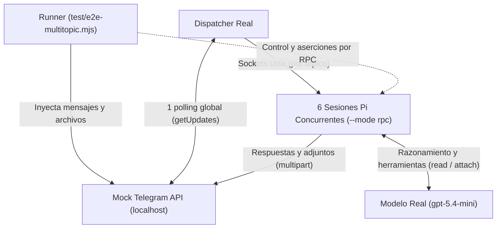

# Test End-to-End Multitópico (Telegram Forum Topics)

## Resumen del Test

Prueba end-to-end multitópico para el puente Telegram ([`pi-telegram`](../README.md)). Ejecuta **procesos Pi reales** en modo RPC con el **modelo real `gpt-5.4-mini`** y la extensión de producción ([`index.ts`](../index.ts)) sin alterar.

El **único componente simulado** es la API de Telegram mediante un servidor HTTP local en localhost.

| Métrica / Parámetro | Configuración |
|---|---|
| Comando | `npm run test:e2e` o `node test/e2e-multitopic.mjs [1-6]` |
| Modelo real | `openai-codex/gpt-5.4-mini` (configurable vía `PI_MODEL`) |
| Procesos Pi reales | **Hasta 6 simultáneos** (`--mode rpc`) |
| Puente y Dispatcher | Producción sin alterar ([`index.ts`](../index.ts) y [`dispatcher.mjs`](../dispatcher.mjs)) |
| Entradas de usuario | **2 olas por sesión** (Ola 1: texto simultáneo; Ola 2: adjunto bidireccional) |
| Transferencias de archivos | Verificación byte a byte de descarga y subida multipart por tópico |
| Redirección de red | [`test/mock-telegram.mjs`](mock-telegram.mjs) (intercepta Telegram sin alterar tráfico del LLM) |

---

## Arquitectura de Alto Nivel



---

## Secuencia de Ejecución

1. **Credenciales y Entorno:**
   - Lee la credencial `openai-codex` desde `~/.pi/agent/auth.json`.
   - Crea un directorio temporal aislado con configuración ficticia de Telegram (`botToken: '1:e2e_test'`, forum supergroup `-100`).
2. **Servidor Mock de Telegram:**
   - Inicia un servidor HTTP local simulando la API de Telegram (`getMe`, `getChat`, `createForumTopic`, `getUpdates`, `getFile`, `sendMessage`, `sendDocument`).
3. **Dispatcher Real:**
   - Lanza [`dispatcher.mjs`](../dispatcher.mjs) conectado al mock y expone `dispatcher.sock`.
4. **Instancias Pi RPC:**
   - Lanza $N$ procesos de Pi (`pi --mode rpc --tools read,telegram_attach -e index.ts`).
   - Envía `/telegram-connect` a cada Pi vía RPC para crear y enlazar su respectivo tópico en el foro.
5. **Ola 1 (Texto Simultáneo):**
   - Encola $N$ mensajes en simultáneo en el mock de Telegram.
   - El dispatcher procesa `getUpdates` y distribuye cada mensaje a su sesión Pi por su socket Unix.
   - Verifica que cada Pi responda con su marcador único `RPC_TEST_${index}_A` al tópico asignado.
6. **Ola 2 (Ida y Vuelta de Adjuntos):**
   - Publica en cada tópico un archivo `dummy-${index}.txt` con token único.
   - Cada Pi descarga el archivo, lo lee con la herramienta `read` y lo devuelve mediante `telegram_attach`.
   - El mock intercepta la subida multipart `sendDocument` y **valida byte a byte que el contenido coincida exactamente con el archivo original del tópico**.
7. **Cierre:**
   - Termina los procesos hijos y elimina los archivos temporales.

---

## Ejecución

### Ejecución Rápida (1 Sesión)
```bash
node test/e2e-multitopic.mjs 1
```

### Ejecución Completa (6 Sesiones Simultáneas)
```bash
npm run test:e2e
# o directamente:
node test/e2e-multitopic.mjs 6
```
